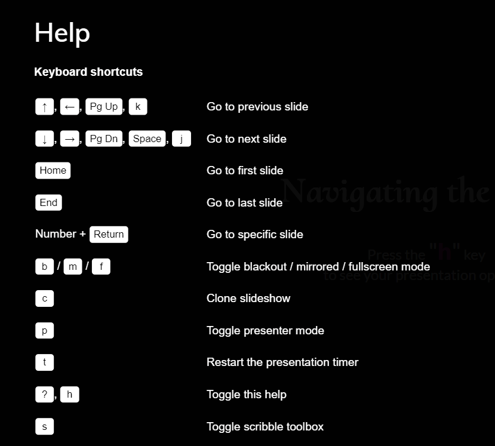
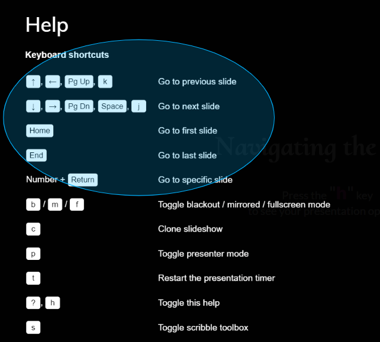
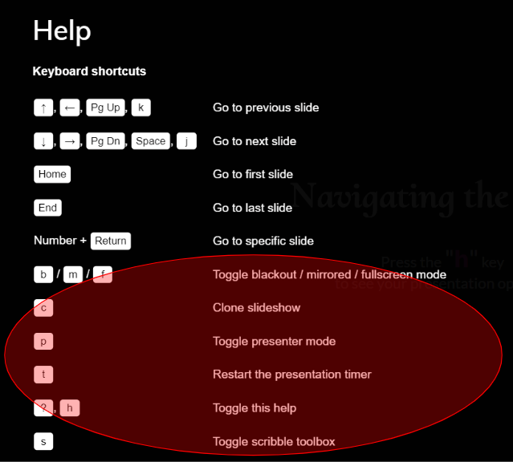
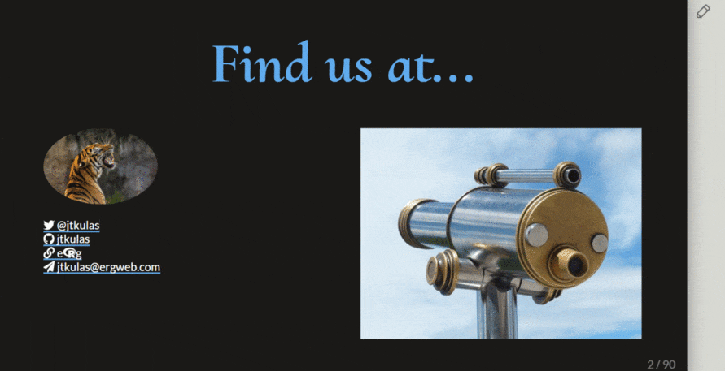

```{r setup, include=FALSE}
options(htmltools.dir.version = FALSE)
library(knitr)
knitr::opts_chunk$set(warning = FALSE, message = FALSE)
# options(knitr.table.format = "html")
library(tidyverse)
library(babynames)
library(fontawesome) # from github: https://github.com/rstudio/fontawesome
library(DiagrammeR)
```


```{r xaringan-scribble, echo=FALSE}

## https://pkg.garrickadenbuie.com/xaringanExtra/#/scribble

xaringanExtra::use_scribble()          ## page load times much worse with this enabled - allows marking on slides
## xaringanExtra::use_slide_tone()     ## use for visually impaired

```

layout: true
  
<div class="my-footer"><span>www.ergreports.com</span></div>

<!-- this adds the link footer to all slides, depends on my-footer class in css-->

---
name: xaringan-title
class: left, middle, inverse
background-image: url(img/learn.jpg)
background-size: cover 

# 


### .salt[.fancy2[Tutorial on using]] .large[.Erg[e]`r fa("r-project", fill="#1A1E87")`.erG[g]] <br>.salt[.fancy2[feedback slides]]

.black[John-o Kulas | **.large[.Erg[e]`r fa("r-project",fill="#1A1E87")`.erG[g]]** | `r Sys.Date()`]

<!-- this ends up being the title slide since seal = FALSE-->
---

name: keyboard-demo
class: center, middle, inverse

.pull-left[
# .fancy[Navigating the slides]

Press your keyboard's .fancy[.large[.neon["H"]]] key <br> to toggle presentation options. 


]

--

.pull-right[
.large[Take some time to familiarize yourself with these options:]  


]

---

class: center, middle, inverse

.pull-left[
Note the difference in option groupings between .large[.bluecircle[navigation...]] 


]

--

.pull-right[
...and .large[.redbracket[presentation]]


]

---


**Especially** if you have two screens, press `c` to clone your slides:

.pull-left[

# `r fa(name = "desktop", fill = "white")`

On the **presentation** screen:

Move the cloned window here, <br>
then press `f` for full-screen mode

]

.pull-right[

# `r fa(name = "laptop", fill = "white")`

On **your** computer screen:

Press `p` for presenter mode 
]

???

Your notes will be available to you here in presenter mode (but only you will see them)  

---
name: draw
class: right, inverse, bottom

.left-column[
# Also take note of the <br> .fat[.fancy["Pencil"!]] `r anicon::faa("pencil-alt", animate="wrench")`
]

.right-column[

]

---
name: ninja
class: middle, inverse

## You can .salt[.fancy[edit]] your slides by activating the pencil:


---

name: xaringan

# .center[What is xaringan?]

.pull-left[

.center[


and


and


]

]

--

.pull-right[

To create:

> .fancy["An R package for creating HTML5 presentations with remark.js through R Markdown."]

```{r echo = FALSE}
knitr::include_url("https://jtkulas.github.io/slides/", height = "300px")
```
]
---

.left-column[
### `Interactive Graphics!`
]

.right-column[

```{r out.width='100%', fig.height=6, eval=require('leaflet'), echo=FALSE}
library(leaflet)
leaflet() %>% addTiles() %>% setView(lat = 45.0482, lng = -93.2474, zoom = 12)
```
]

---

class: left, top, inverse

# .salt[.fancy[Questions or Feature Requests???]]

.pull-left[

# .fancy[Find us at...]
<!---  -->

[`r fa(name = "paper-plane")` jtkulas@ergreports.com](mailto:jtkulas@ergreports.com)  
[`r fa(name = "link")` e`r fa("r-project")`g](https://www.ergreports.com)  
[`r fa(name = "twitter")` @jtkulas](http://twitter.com/jtkulas)  
[`r fa(name = "youtube")` Forensic Psychometrics](https://www.youtube.com/@forensicpsychometrics8300)  
[`r fa(name = "github")` jtkulas](http://github.com/jtkulas)  
]

.pull-right[

]

